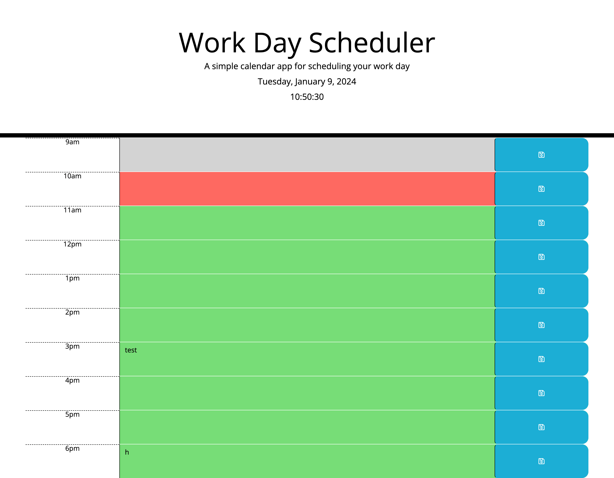

# work-day-scheduler

## Description
A calendar application that allows a user to save events for each hour of the day.

## Usage

This app:
-   Displays the current day and time at the top of the calender when a user opens the planner.

- Presents time blocks for standard business hours when the user scrolls down.

- Color-codes each time block based on past, present, and future when the time block is viewed.

- Allows a user to enter an event when they click a time block

- Saves the event in local storage when the save button is clicked in that time block.

- Keeps events between refreshes of a page

## Credits
Tutor Cody Junier
Class TA Chris Kratz

## License

MIT License

Copyright (c) 2024 Sarah Egleston

Permission is hereby granted, free of charge, to any person obtaining a copy
of this software and associated documentation files (the "Software"), to deal
in the Software without restriction, including without limitation the rights
to use, copy, modify, merge, publish, distribute, sublicense, and/or sell
copies of the Software, and to permit persons to whom the Software is
furnished to do so, subject to the following conditions:

The above copyright notice and this permission notice shall be included in all
copies or substantial portions of the Software.

THE SOFTWARE IS PROVIDED "AS IS", WITHOUT WARRANTY OF ANY KIND, EXPRESS OR
IMPLIED, INCLUDING BUT NOT LIMITED TO THE WARRANTIES OF MERCHANTABILITY,
FITNESS FOR A PARTICULAR PURPOSE AND NONINFRINGEMENT. IN NO EVENT SHALL THE
AUTHORS OR COPYRIGHT HOLDERS BE LIABLE FOR ANY CLAIM, DAMAGES OR OTHER
LIABILITY, WHETHER IN AN ACTION OF CONTRACT, TORT OR OTHERWISE, ARISING FROM,
OUT OF OR IN CONNECTION WITH THE SOFTWARE OR THE USE OR OTHER DEALINGS IN THE
SOFTWARE.
